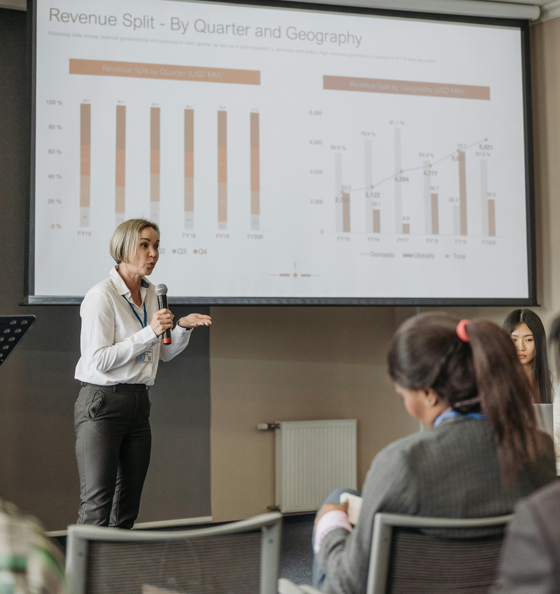
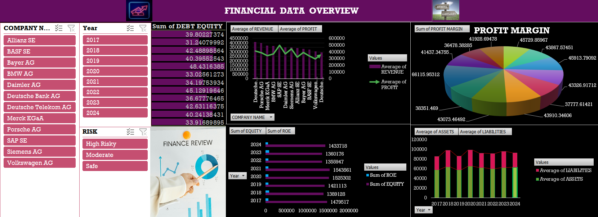

# FINANCE-OVERVIEW ANALYSIS

## Overview : 
This dashboard is for presenting my insights of Financial growth to the diffrent top 20 campanies.I have created a dashboard which can help me discuss the operations of these campanies with my higher-ups. This will be done solely to optimize the operations.

## Tool used :

---

## Result and Insights :
- The bar chart indicates that average revenue is generally higher than average profit.
- Companies with larger pie slices (higher margins) more profitable or better at managing costs.
- An upward trend in assets, is not matched by a similar rise in liabilities, it indicates stronger financial health.
- The “High Risk,” “Moderate,” and “Safe” categorization helps quickly identify the financial stability of each company.This is useful for investors to prioritize research or allocation of funds.
- ROE and Equity sums by year help measure profitability and shareholder value creation over time.Consistent or growing ROE  indicates effective management and sustainable operations.

---

## Data Story :
I have noticed that the Over the past seven years (2017-2024),most companies have experienced steady revenue growth.Monitoring year-over-year changes will help in adjusting strategies in real time, ensuring that rising liabilities do not erosion profitability. Finally, for lower-risk companies with strong balance sheets, strategic investments could help capture more market share.
---

## Dashboard :

